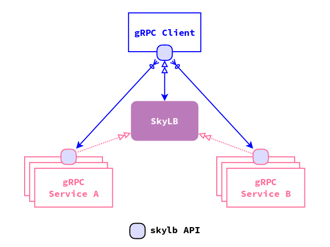

# SkyLB API User Guide (in Golang)

## Overview



As we all know, gRPC favors reusing one connection for all requests instead of
creating a new connection for each request. It has the benefit of better
utilization of resources and lower latency. Its disadvantage is that the
traditional way of load balancing will not work for gRPC. Based on gRPC's
load balancing interfaces, SkyLB implemented a mechanism to load balance gRPC
traffic. SkyLB-API encapsulates the communication with SkyLB and provides an
easy interface for developers to work with gRPC.

This user guide assumes that you have enough knowledge and experience with
gRPC and all you want to know is how to use SkyLB and SkyLB-API to implement
gRPC load balance. It also assumes you already have a SkyLB cluster installed.
In this user guide, we assume the SkyLB instances are at 192.168.1.1:1900 and
192.168.1.2:1900, and 192.168.1.3:1900.

Note that if the SkyLB server is running out side of Kubernetes, it should start
with flag --within-k8s=false.

We'll create two gRPC demo services and a gRPC demo client to show how to work
with SkyLB through SkyLB-API in Golang.

## Define Your Vexillary Service IDs

First of all, you have to register your gRPC service at vexillary-client/proto/data/data.proto.
Add a new ServiceId enum value for your gRPC service. The enum name will be
converted to the service name such that "VEXILLARY_DEMO" will be converted to
"vexillary-demo". Golang package letsgo/service/naming/naming.go provides handy
functions to convert from/to the service enum and service name.

For this user guide, we'll choose to use the existing test services defined as:

```proto
	// 1-10: Vexillary test services.
	VEXILLARY_DEMO   = 1;
	VEXILLARY_TEST   = 2;
	VEXILLARY_CLIENT = 3;
```

As shown above, each client of the gRPC service should also have its Vexillary
Service ID. When starting the client, the client should tell SkyLB who it is.

## Define your gRPC Service Proto

We are not going to elaborate it here since you are assumed already familiar
with gRPC. But at least, you should have a protocol buffer definition of the
service and a canonical gRPC implementation.

## Choose a Port Name for gRPC service

A real service might expose more than one ports (including your gRPC service
port) to its client. To help SkyLB identify the port your service will work
on, you need to give the port a name, such as "grpc-port".

## Add SkyLB-API call to gRPC Service

Now that you created the service proto, you can write your gRPC service
implementation:

```golang
import (
	skylb "binchencoder.com/skylb-api/server"
	vexpb "binchencoder.com/gateway-proto/data"
)

...
skylb.Register(vexpb.ServiceId_VEXILLARY_TEST, "grpc-port", *port)
skylb.Start(fmt.Sprintf(":%d", *port), func(s *grpc.Server) error {
	pb.RegisterDemoServer(s, &greetingServer{})
	return nil
})
```

That's all you need to add to your gRPC service. It registers the service
VEXILLARY_TEST to SkyLB with port name "grpc-port" and port 8000, and makes
the service discoverable. If the server starts without problem, Start() blocks
until the server shuts down.

Note that if your service is running in Kubernetes, skylb.Register() will do
nothing, because Kubernetes has its own mechanism of service register and
discovery.

### Start the gRPC service

To start your service out of Kubernetes, run command as follows:

```bash
./mygrpcserver --skylb-endpoints 192.168.1.1:1900,192.168.1.2:1900,192.168.1.3:1900 --within-k8s=false --alsologtostderr -v=3
```

To start your service in Kubernetes, remove "--within-k8s=false".

## Add SkyLB-API call to gRPC Client

### rpc package

Adding SkyLB-API call to gRPC client needs much more work. First, remember that
gRPC favors creating one connection to share with all client invocations. So
the best way is to create a standalone package to hold the gRPC client object.
Let's add a "rpc" package to your code base:

```
├── cmd
    └── mygrpcclient
        ├── rpc
            ├── BUILD
            └── rpc.go

```

#### Global Variables
In rpc.go, you need to define some global variables to hold the shared states:

```golang
import (
	"google.golang.org/grpc"

	skylb "binchencoder.com/skylb-api/client"
	pb "..." // Protocol buffer of your gRPC server.
	skypb "binchencoder.com/skylb-api/proto"
	vexpb "binchencoder.com/gateway-proto/data"
)

var (
	skycli skylb.ServiceCli

	// The gRPC client for vexillary-demo API.
	DemoCli pb.DemoClient
	// The gRPC client for vexillary-test API.
	TestCli pb.DemoClient
)
```

skylb.ServiceCli is the API through which your client talks to SkyLB for service
endpoint updates. It should be created only once. Also note that it's package
private and we'll assign value to it later.

DemoCli and TestCli are the gRPC clients for two services. They are publically
exposed and can be used from any other packages, even concurrently.

#### Init() and Shutdown()

Next, provide an Init() function and a Shutdown() function.

```golang
// Init intialize the gRPC client.
func Init() {
	...
}

// Shutdown turns off the client
func Shutdown() {
	...
}
```

They are publically exposed so that your client code can call them. Init()
initializes the gRPC client and Shutdown() turns it off. They should be called
only once.

#### Initializaztion

In function Init(), you need to do three things: create the service cli, call
Resolve() for each service, and call Start() to get back the gRPC client.

```golang
skycli = skylb.NewServiceCli(vexpb.ServiceId_VEXILLARY_CLIENT)

// Resolve service "vexillary-demo".
demoSpec := skylb.NewServiceSpec(vexpb.ServiceId_VEXILLARY_DEMO, portName)
skycli.Resolve(demoSpec)

// Resolve service "vexillary-test".
testSpec := skylb.NewServiceSpec(vexpb.ServiceId_VEXILLARY_TEST, portName)
skycli.Resolve(testSpec)

skycli.Start(func(spec *skypb.ServiceSpec, conn *grpc.ClientConn) {
	switch *spec {
	case *demoSpec:
		DemoCli = pb.NewDemoClient(conn)
	case *testSpec:
		TestCli = pb.NewDemoClient(conn)
	}
})
```

Note that skylb.NewServiceCli() takes the service ID of the client.

#### Shutdown

The Shutdown() function is as simple as just call the service cli's Shutdown()
function:

```golang
skycli.Shutdown()
```

### Hook Everything Up

With the rpc package ready, we only need to hook it in your main program, like:

```golang
import (
	"binchencoder.com/<repo-name>/cmd/mygrpcclient/rpc"
)

func main() {
	rpc.Init()
	defer rpc.Shutdown()
}
```

Now, at any place you need to call the gRPC service, you can simply do it:

```golang
resp, err := rpc.DemoCli.Greeting(context.Background(), &req)
```

The call will be load balanced nicely.

### Start the gRPC Client

To start your client out of Kubernetes, run command as follows:

```bash
./mygrpcclient --skylb-endpoints 192.168.1.1:1900,192.168.1.2:1900,192.168.1.3:1900 --alsologtostderr -v=3
```

To start your service in Kubernetes, remove "--within-k8s=false".

You'll see the gRPC call succeeding. Try to add more service instances and
remove some of them, observe how gRPC client get updated.

## Debug without SkyLB

On DEV environment, sometimes you have to test without SkyLB. Flag
"--debug-svc-endpoint" can be used to notify SkyLB-API to use a local
endpoint directly. Take the demo program as an example, you can run:

```bash
./mygrpcclient --debug-svc-endpoint=vexillary-demo=localhost:8080 --debug-svc-endpoint=vexillary-test=localhost:8085 --alsologtostderr -v=3
```

It specifies to use localhost:8080 for gRPC service vexillary-demo and
localhost:8085 for gRPC service vexillary-test. Note that the flag can be
specified multiple times.

Furthermore, you can also specify the flag to overwrite some of the services,
meanwhile still use SkyLB to resolve the others. It is useful when you are
testing a local change of a service on your DEV environment but utilize the
other services in TEST environment.

## Auto Monitoring with Prometheus

The SkyLB server API automatically starts a HTTP server which serves both
Prometheus and Golang pprof for debugging purpose. The server reuses the
same port as the gRPC service. For example, if a gRPC service is running
on port 8000, the prometheus metrics can be accessed with:

http://localhost:8000/_/metrics

and the pprof debugging page can be accessed with:

http://localhost:8000/_/debug/pprof/

By default, the histogram metrics are turned off for performance reasons. To
enable it, run

```golang
skylb.EnableHistogram()
```

on your server side code.
